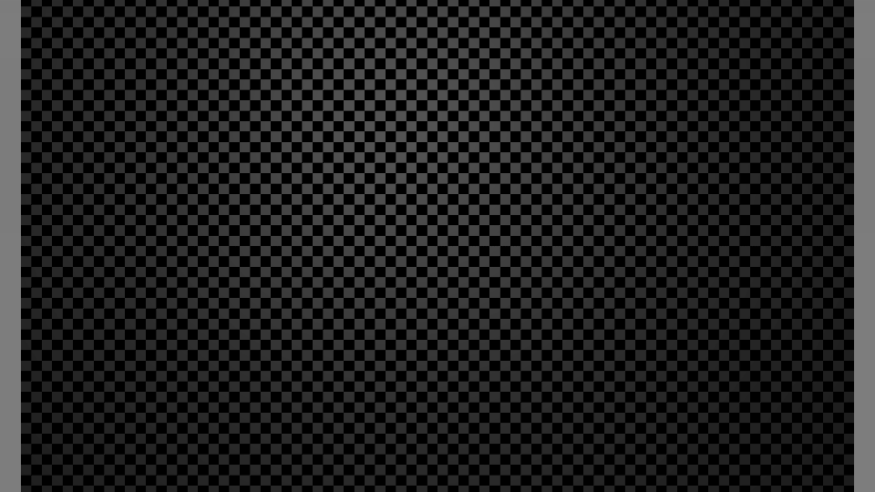
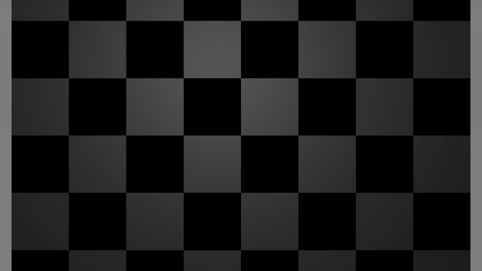
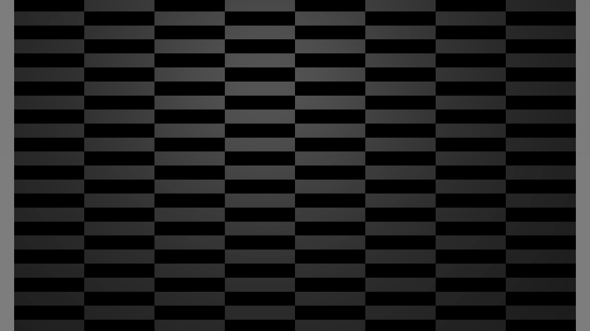
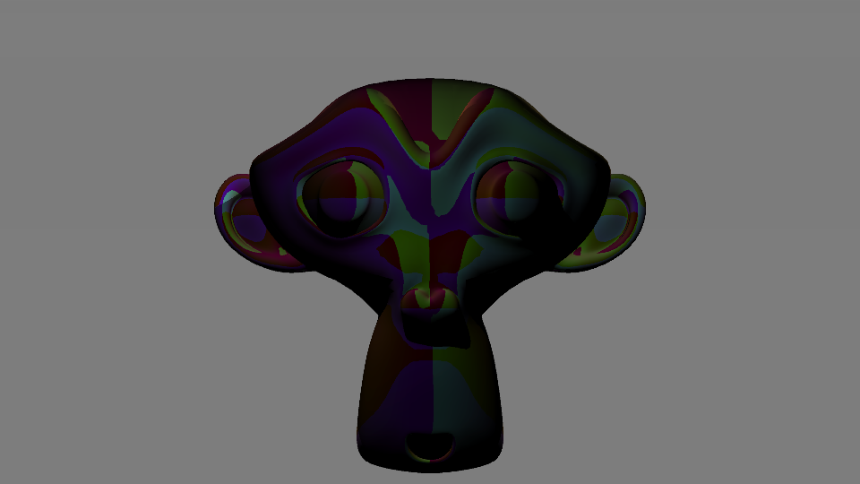
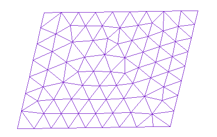
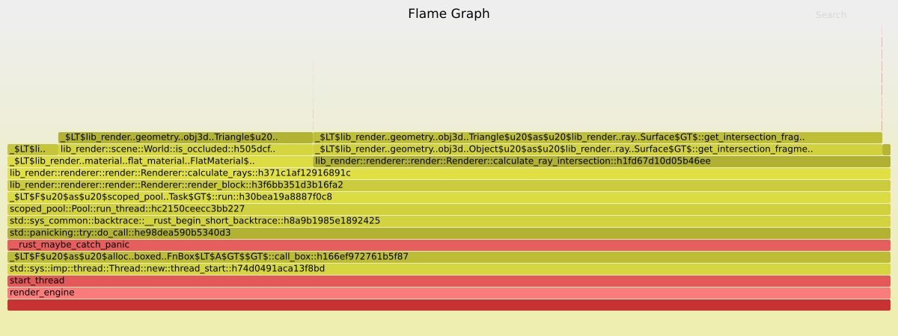

% Implémentation d'un moteur de rendu en lancer de rayon basé sur un modèle physique réaliste.
% Paul FLORENCE; Louis JEAN
% 25 Mai 2017


\newpage

# Introduction

Par la suite, les commandes bash seront préfixées par un $.
Tout code issu du projet sera précédé d'un commentaire indiquant le chemin où il se trouve.

## L'histoire du raytracing

Le raytracing est une technique développée dans les années 60 permettant la synthèse d'images par un ordinateur. Cette technique a connu un boom dans les années 90 pour permettre la réalisation d'effets spéciaux dans le cinéma.

C'est une méthode désormais utilisée dans de nombreux domaines : pré-visualisation architecturale, cinéma, dessin animé, publicité, etc.

## L'interêt de ce projet pour nous

Les enjeux autour du raytracing sont très importants, il existe toute une industrie organisée autour de cette technique de rendu, avec plusieurs millions de personnes qui utilisent chaque jour des moteurs de rendu en lancer de rayon.

De plus c'est un sujet qui nous intéressait personnellement, puisque nous avons déjà tous deux utilisé des moteurs de rendu (Cycle avec Blender, Vray avec 3DSMax).

Enfin, le sujet se prêtait particulièrement bien au cadre de ce projet, puisqu'il est très motivant. En effet, nous avons directement un retour sur investissement à travers les images qui sortent directement de notre moteur de rendu.

# Notre méthode de travail

## Pourquoi Rust ?

Dès le départ nous avons voulu partir sur un langage de programmation système, afin d'obtenir le maximum de performances.

Le seul langage sur ce créneau est le C/C++, cependant nous avons déjà eu plusieurs expériences tous les deux avec C++, et le fait que le langage soit très permissif à la compilation, retardant les bugs à l'exécution nous dérangeait.

Cependant, depuis 2015 il existe un nouveau langage, poussé par Mozilla, nommé Rust.

> Rust est un langage de programmation compilé multi-paradigme conçu et développé par Mozilla Research. Il a été conçu pour être « un langage sécurisé, concurrent, pratique », supportant les styles de programmation purement fonctionnel, modèle d'acteur, procédural et orienté objet.
[Wikipedia](https://fr.wikipedia.org/wiki/Rust_(langage))

Les principaux points forts de Rust sont :

 * La sûreté de la mémoire est assurée à la compilation, il n'existe pas de `segfault` en Rust.

 * La concurrence est gérée de manière interne au langage: il n'existe pas de course aux données en Rust. Ce point nous a été très utile pour paralléliser le moteur de rendu.

 * L'écosystème moderne (gestionnaire de paquet, compilateur, libraire standard, etc.). En effet, pour installer une libraire il suffit d'ajouter une ligne: toutes les dépendances sont gérées par `cargo` qui est le gestionnaire de projet de Rust. Un autre avantage de l'écosystème moderne est le compilateur, qui contrairement à g++/clang++ (deux compilateurs C++) offre des erreurs compréhensibles ainsi que des méthode pour les résoudre.


Il existe aussi des points faibles vis-à-vis de ce langage, la plupart découlant de la jeunesse du langage :

 * Les librairies sont généralement encore jeunes et pas toujours stables.

 * La compilation est lente, le compilateur ne parallélise pas les tâches.

 * le langage est "verbeux"

Ainsi avoir choisis Rust nous a permis de drastiquement résoudre notre temps passer à débugger le programme, puisque les seules erreurs que nous pouvions commettre étaient dues à des erreurs d'algorithmie.

## Organisation et planification du projet

### Découpage du projet en tâches, versionnement

Afin de découper le projet en tâches, nos avons choisi la liste des fonctionnalités qui devaient être implémentées pour chaque nouvelle version du logiciel.
Ainsi, dès le début nous avions une visibilité assez claire sur le fonctionnement final du logiciel.

Ainsi nous avions prévu assez grossièrement d'avoir un projet qui se déroule ainsi :

* v0.1 :
	* Support de la géométrie dans des fichiers .obj
	* Benchmarking du code
	* Choix de la résolution
* v0.2.1 :
	* Support des textures
	* Support des matériaux basiques
* v0.2.2 :
	* Support du multithreading
	* Optimisation via les boîtes englobantes
* v0.3 :
	* Base des lumières
	* Meilleur échantillonneur
	* Meilleur filtre de reconstruction

Les versions suivantes n'ont pas été implémentées faute de temps :

* v0.4 :
	* [Path-tracing](https://fr.wikipedia.org/wiki/Path_tracing)
* v0.5 :
	* Matériaux avancés : réflexion, réfraction, etc.

### Organisation du travail

Pour travailler collaborativement de manière efficace nous avons décidé de chacun travailler sur des modules séparés, tout en se tenant au courant régulièrement de nos avancées.

En général, nous avons plutôt bien réussi à faire en sorte que chacun travaille sur un module différent, même s'il n'était pas rare que l'on ait à toucher tous les deux en même temps un module déjà écrit. Heureusement, Git nous a permis de partager le code sans problème, nous n'avons jamais perdu une ligne de code.

Nous nous tenons au courant des dernières modifications sur le répertoire distant Github au jour le jour, et on discute des modifications faîtes dans la section commentaire des commits  ([Exemple 1](hhttps://github.com/gbip/rust-render-engine/commit/6560550e0675f733d3add030f5daca220005c9b9) , [Exemple 2](https://github.com/gbip/rust-render-engine/commit/14bb527cb97e96f17ed9523136d8eb6259d800c6)).

Enfin, nous profitons des créneaux de projet pour se mettre d'accord sur l'architecture du logiciel et le découpage des modules.

Cela a vraiment bien marché, car nous avons réussi à être très productif, et nous n'avons pas eu de problème majeur avec la synchronisation des fichiers.

De plus, cela a permis à chacun de faire ce qui lui plaisait le plus, quitte à travailler en même temps sur la même fonctionnalité si il y avait un module que l'on voulait tous les deux implémenter.

## Les outils que nous avons utilisés

### Clippy

En plus du compilateur, nous avons utilisé [Clippy](https://github.com/Manishearth/rust-clippy). Il s'agit d'un analyseur statique de code qui ajoute 197 warnings au compilateur, allant de l'erreur d'algorithmie au respect des conventions de code.
Avoir un outil qui analyse notre code a été un gros avantage, puisque cela nous a permis d'avoir un code qui respecte à 100% la manière de penser du langage Rust.
Nous avons aussi pu éviter quelques erreurs d'inattention avant l’exécution.

### Git

Afin de pouvoir travailler collaborativement, nous avons utilisé le logiciel de gestionnaire de version `git`. Il s'agit d'un gestionnaire de version décentralisé.
Avec git chaque développeur regroupe ses modifications en commits. Lorsque une ligne a été modifiée par plusieurs développeurs, il y a conflit, et il faut le résoudre à la main.
Enfin le code se trouve sur un répertoire distant, ce qui permet d'assurer la synchronisation des versions via internet.


Vous pouvez accéder au répertoire distant du projet sur [github](https://github.com/gbip/rust-render-engine).

### Test unitaires

Afin de s'assurer du fonctionnement de chaque fonctionnalité nous avons écrit des tests unitaires au fur et à mesure du développement.
Le projet final comporte 20 tests unitaires, ce qui est peu, mais chaque test réalise en réalité plusieurs vérifications.

### Travis

A chaque fois que quelqu'un envoie des commits sur le répertoire distant, le service d'intégration continue **Travis** se met en route.
Celui-ci récupère le code et lance plusieurs commandes :
```
$ cargo fmt -- --write-mode=diff
$ cargo build
$ cargo test
```
La première commande vérifie que le code est bien formaté, elle quitte avec un code d'erreur différent de 0 si il est nécessaire de formater le code.
La deuxième commande compile le code.
La troisième commande compile et lance les tests unitaires.
Si jamais une de ces étapes échoue, nous recevons un mail, et les commits sont marqués comme échouant les test d'intégration continue.
Il est possible de voir à tout moment le statut du projet [sur le site internet de Travis](https://travis-ci.org/gbip/rust-render-engine).

### Formatage du code

Afin d'avoir une base de code avec un style constant, nous utilisons l'outil [rustfmt](https://github.com/rust-lang-nursery/rustfmt) qui est l'outil standard pour formater du code source en Rust.
Ce programme est lancé à travers cargo, et lors de son exécution il va parcourir tous les fichiers sources et les formater selon des règles de style définies dans un fichier.
Nous utilisons les règles de style par défaut.

Enfin, il est possible de mettre en place des script permettant de lancer cet outil automatiquement. Par exemple, sur Vim, rustfmt est lancé à chaque fois que l'on sauvegarde le buffer courant.
Sur Intellij IDEA il est possible de lancer le formatage du code avant toute compilation.

### Documentation

Nous avons essayé de documenter au maximum le projet. Malheureusement, la documentation est quand même très éparse.
En effet, nous avons beaucoup documenté le fonctionnement des fonctions via des commentaires décrivant les différentes lignes composant une fonction,
cependant il y a peu de documentation décrivant le fonctionnement du code en général.

### Compiler le projet, générer la documentation et lancer les test unitaires.

Pour installer le projet il faut commencer par installer [rustup](https://rustup.rs/).
```
$ curl https://sh.rustup.rs -sSf | sh
```

Ensuite vous pouvez télécharger le répertoire avec git, et compiler le projet.
```
$ sudo apt-get install git
$ git clone https://github.com/gbip/rust-render-engine
$ rustup override set nightly-2017-05-18
$ cargo build --release
```

Pour lancer les test unitaires, il faut exécuter `cargo test` dans le répertoire du projet.
Pour compiler la documentation, il faut exécuter `cargo doc` dans le répertoire du projet.

### Langue des variables, du code et de l'interface

Nous sommes partis du principe que le standard, en informatique est l'anglais. Ainsi tous les noms de variables, de fonctions, de modules et de structures de données
sont en anglais.
De plus, l'interface en ligne de commande est elle aussi en anglais.
Cependant, afin de faciliter leur rédaction, leur lecture et leur compréhension, les commentaires sont en français.

# Scénario de fonctionnement

Nous avons choisi, pour des raisons de simplicité, de nous contenter d'une interface en lignes de commandes pour l'interaction avec l'utilisateur.

## Interface de commande avec l'utilisateur

Lorsque l'on lance le logiciel sans argument, un message d'aide s'affiche indiquant à l'utilisateur comment utiliser le logiciel.
C'est une pratique standard dans l'environnement UNIX:
```
$ ./render_engine
Usage : ./render_engine -g FILE -r FILE -w FILE
```

Détaillons les différents arguments :

 * > -g FILE or --generate FILE : Generate a template file in the location FILE for creating a scene

 Il s'agit là d'une option qui doit être utilisée toute seule : le logiciel est en mode "génération de structure" et ne cherchera même pas à charger le fichier de scène si il est spécifié.
 Les fichiers générés montrent comment créer une scène:

  * *template.json* : la description de la scène

  * *template_material_solid.json* : un exemple de matériau sans texture (couleur unie)

  * *template_material_texture.json* : un exemple de matériau avec une texture

 Nous détaillons dans la partie [Fichiers d'objets, de matériau et de scène] les différents fichiers nécessaires à la création d'une scène.


 * > -r FILE or --read FILE : Read FILE to load the scene before rendering. Needed for rendering, without a scene specified, the program will not render.

Cette option précise au logiciel quel fichier il doit lire pour créer la scène. Si cette option n'est pas spécifiée, le programme ne pourra pas lancer le rendu d'une scène.
Cette option est suffisante pour lancer la procédure de rendu, le logiciel sauvegardera alors l'image sous le nom 'untitled.png'.

* > -w FILE or --write FILE : Write the output to FILE. The default is 'untitled.png'

Cette option indique au logiciel où doit être enregistrée l'image de sortie. Si cette option n'est pas présente, l'image sera enregistrée dans le fichier 'untitled.png'

## Formats de fichiers d'objets, de matériaux et de scènes
La principale interaction avec l'utilisateur se fait au travers des fichiers décrivant respectivement, la scène, les matériaux et les objets. Nous avons choisi d'utiliser le format [JSON](https://fr.wikipedia.org/wiki/JavaScript_Object_Notation) car il est plus simple à modifier que du XML, et est lui aussi lisible très facilement par un humain.
Enfin, il existe deux structures qui se retrouvent régulièrement dans les fichiers de scènes :

* Les coordonnées cartésiennes d'un point dans l'espace :
```json
"point": {
    "x": 0.0,
    "y": 0.0,
    "z": 5.0
}
```

* les différents composantes d'une couleur : il s'agit de quatre entiers compris entre 0 et 255 pour chaque composante Red Green Blue (transparence) RGB :
```json
"background_color": {
	"r": 0,
    "g": 127,
    "b": 254,
}
```

### La scène

Le fichier de scène correspond au fichier principal qui décris :

* la géométrie présente dans la scène, et le matériau qui y est affecté.

* la ou les caméras présentent dans la scène.

* la ou les lumières qui éclairent la scène.

* les paramètres de rendu.


Voici la description des différents champs qui composent ce fichier :

* *base_vector* : ce champ indique quels sont les trois vecteurs formant la base orthonormée pour représenter la géométrie dans l'espace

* *cameras* : il s'agit d'un tableau de [Caméra]

* *objects*  : les différents objets composants la scène (géométrie et matériau)

* *lights* : il s'agit d'un tableau de [Lumières]

* *renderer*  : les différents paramètres du rendu :
	* *res_x*,*res_y* : la résolution de l'image a calculer
	* *threads* : le nombre de cœurs à utiliser pour le calcul
	* *bucket_size* : taille des blocs subdivisant l'image pour la répartition du travail entre les cœurs
	* *sampler* : les paramètres de la génération des échantillons :
		* *HaltonSampler* ou *UniformSampler* permettent de choisir la méthode de génération des échantillons sur l'image 2D. *Haltonsampler* offre la meilleur qualité.
		* *subdivision_sampling* : le paramètre crucial qui va énormément jouer sur la qualité de l'image finale. Il s'agit du nombre de rayons qui vont être lancés par pixel.
	* *filter* : les paramètres pour la reconstruction des pixels à partir des rayons :
		* *BoxFilter* ou *MitchellFilter* permettent de choisir quelle méthode utiliser lors du rendu. MichellFilter offre en théorie la meilleur qualité.
	* *background_color* : la couleur de fond lorsque aucun objet ne viens obstruer le rayon.


```json
{
  "world": {
    "base_vector": [],
    "cameras": [],
    "objects": [],
    "lights": []
  },
  "renderer": {
    "res_x": 960,
    "res_y": 540,
    "threads":8,
    "bucket_size":17,
    "sampler": {
      "HaltonSampler": {
        "subdivision_sampling": 4
      }
    },
    "filter": "BoxFilter",
    "background_color": {
      "r": 0,
      "g": 0,
      "b": 0,
      "a": 255
    }
  }
}
```

Le nombre de paramètres exposés est relativement important, et avec du recul certains n'ont pas leur place ici.
Par exemple *base_vector* ne devrait même pas être exposé à l'utilisateur, c'est une convention que nous utilisons en interne.
De plus certains arguments pourraient être donnés en ligne de commande, comme le nombre de cœur à utiliser pour le calcul.

### Caméra

La caméra est composé des champs suivants :

* *world_position* : la position de la caméra dans le monde. C'est le point à partir duquel on voit la scène.

* *target_position* : un point de l'espace vers lequel on regarde. Celui-ci est au centre de l'écran. Il permet d'orienter la caméra.

* *up* : un vecteur qui indique le 'haut' de l'image, utiliser pour faire tourner la caméra.

* *fov* : de l'acronyme 'Field of View', indique le champ de vision en degré de la caméra. Une valeur plus petite correspond à un effet de zoom.

* *clip* : la distance à partir de laquelle les rayons sont arrêtés par les objets. Dans notre exemple, si un objet se trouve à moins de 0.001 de la caméra, il ne sera pas visible.

```json
{
	"world_position": {
        "x": 0.0,
        "y": 0.0,
    	"z": 5.0
    },
	"target_position": {
        "x": 10.0,
        "y": 0.0,
    	"z": 5.0
    },
    "up": {
        "x": 0.0,
        "y": 0.0,
    	"z": 1.0
    },
    "fov": 70.0,
	"clip": 0.001
}
```


### Objets


L'utilisation d'un objet fait appel à plusieurs fichiers :

* le fichier qui contiens les informations de géométrie.

* la section dans le fichier de scène qui indique la position de l'objet.

* un matériau.


#### Dans la scène

Ajouter un objet dans une scène consiste à spécifier les champs suivants :

* *position* : la position de l'objet.

* *scale* : un facteur d'échelle permettant de modifier la taille de l'objet selon plusieurs axes.

* *rotation* : la rotation de l'objet autour de chacun des axes.

* *obj_path* : le chemin vers un fichier .obj qui contiens les informations sur la géométrie.

* *visible* : ce booléen indique si l'objet est visible ou non. Si le booléen est à false, alors l'objet ne sera pas affiché.

* *material* : le chemin vers un fichier JSON indiquant les propriétés du matériau dont est fait l'objet. La description d'un matériau se trouve dans [Matériau]

```json
{
	"position": {
        "x": 15.0,
        "y": 0.0,
    	"z": 5.0
    },
	"scale": {
        "x": 2.0,
        "y": 1.0,
    	"z": 2.0
    },
	"rotation": {
        "x": 0.0,
        "y": 0.0,
    	"z": 90.0
    },
    "obj_path": "models/plane_no_uv.obj",
    "name": "Example",
	"visible":false,
	"material" : "scenes/materials/solid_grey.json"
}
```

#### Format de stockage de la géométrie

La géométrie est stockée sous le format [Wavefront Obj](https://fr.wikipedia.org/wiki/Objet_3D_(format_de_fichier)) qui est un format libre.
Un fichier .obj est un fichier texte, qui décris point par point, face par face, la géométrie d'un objet.
Nous ne supportons que les fonctionnalités 'de base' du standard Wavefront.
Notamment, il est impossible :

* de spécifier le matériau d'un objet dans le .obj .

* de grouper plusieurs objets dans un .obj.

Concrètement, il existe 5 types de ligne que nous supportons :

* `o Plane` définit un nouvel objet.

* `v -0.500000 -0.500000 0.000000` définit un nouveau point de coordonnée (0.5,-0.5,0).

* `vt 0.999900 0.000100` définit des nouvelles coordonnées de textures dans le plan 2D.

* `vn 0.000000 0.000000 1.000000` définit un nouveau vecteur normal.

* `f 2/1/1 4/2/1 3/3/1` définit un nouveau triangle composée des 3 points suivants :

	* le premier point a pour coordonnée spatiale le deuxième vertex *v* défini dans le fichier. Il a pour coordonnée de textures le premier point *vt* défini dans le fichier. Il a pour normale le premier vecteur de normal *vn* défini dans le fichier.

	* le deuxième point va chercher le 4éme *v* pour les coordonnées spatiales, le deuxième *vt* pour les textures et le premier *vn* pour les normales.

	* le troisième point a pour coordonnée spatiale le troisième *v*, comme coordonnée de texture le troisième *vt* et comme vecteur normal le premier *v*.

Un exemple de fichier de géométrie est présent dans la partie [Exemple de fichier .obj].

A l'utilisation, la géométrie est générée par [Blender](https://www.blender.org/) car il est impensable d'écrire un fichier .obj à la main.

### Lumières

Pour décrire une lumière il suffit de spécifier les trois champs suivants :

* *point* la position de la lumière.

* *intensity* l'intensité de la lumière. Plus la valeur est grande, plus la source est lumineuse.

* *color* la couleur de la lumière. Permet de créer des lumières de toutes les couleurs, même noires.

```json
{
	"point": {
        "position": {
            "x": 10.0,
            "y": 1.0,
        	"z": 8.0
        },
        "intensity": 10.0,
        "color" : {
            "r": 255,
            "g": 0,
            "b": 255,
        	"a": 255
    	}
	}
}
```

### Matériaux

Le seul type de matériau implémenté actuellement dans le programme est un matériau qui se rapproche beaucoup du [matériau de Phong](https://fr.wikipedia.org/wiki/Ombrage_de_Phong).
Il est composé de trois couleurs ou textures qui représentent chacune une composante spécifique du matériau : *ambient* , *diffuse* et *specular*.

Le fichier JSON d'un matériau se découpe aussi ainsi.A chaque champ est assignable au choix, une couleur unie, une texture ou une texture spéciale :
```json
{
  "diffuse": {
    "color": {
      "r": 204,
      "g": 29,
      "b": 20,
      "a": 255
    }
  },
  "specular": {
    "texture": {
      "map_path": "scenes/textures/checker_2k.jpg",
      "tiling_x": 10.0,
      "tiling_y": 10.0
    }
  },
  "ambient": {
     "normal":{}
  }
}
```

Ici, le champ *diffuse* se voit assigner une couleur unie, le champ *specular* une texture.
Pour la texture, il y a trois paramètres :

* *map_path* qui est le chemin vers le fichier d'image.

* *tiling_x* qui est le nombre de fois que la texture doit se répéter selon l'axe x.

* *tiling_y* qui est le nombre de fois que la texture doit se répéter selon l'axe y.







Le champ *ambient* se voit assigner la texture spéciale *normal* (la seule texture spéciale implémentée) qui va afficher le vecteur normal de l'objet en tout point de la surface. La couleur est déterminée par le produit entre la couleur gris et la normale au point d'intersection.

```rust
// material/channel.rs
// Implémentation de NormalMap
// Création d'une couleur gris
let mut white = RGBA8::new(&128, &128, &128, &128);

// normal est le vecteur normal au point d'intersection normé. Ses coordonnées sont comprises entre 0 et 1.
white.r = (white.r as f32 * normal.x) as u8;
white.g = (white.g as f32 * normal.y) as u8;
white.b = (white.b as f32 * normal.z) as u8;
white.to_rgba32()
```



## Interaction avec l'utilisateur lors du rendu

Lors du rendu, nous communiquons avec l'utilisateur pour le tenir informé du processus de rendu.

Ainsi, nous rappelons le fichier de scène qui est chargé avant de lancer le rendu, au cas où l'utilisateur se serait trompé.
Nous affichons aussi des warnings si jamais le barycentre d'un objet chargé depuis un .obj n'est pas (0,0,0).


Au moment de lancer le rendu, nous rappelons les paramètres essentiels de celui ci : la résolution de l'image finale et le nombre de coeur qui vont être utilisé.

Lors du rendu, nous affichons une barre de progression avec le temps restant estimé et le pourcentage de complétion. Cela permet d'être un peu plus patient lors d'un long rendu, surtout quand celui ci peut durer plusieurs minutes !
Il faut cependant faire attention au temps estimé qui n'est pas toujours très fiable, notamment quand la scène contiens des zones très difficiles à calculer et des zones plus simples.

Enfin, après le rendu nous affichons le temps écoulé, et l'emplacement du fichier de sortie.

## Fonctionnement séquentiel du programme

Dans cette partie, nous allons expliquer le fonctionnement du programme, d'appel de fonction en appel de fonction.

### Décodage des fichiers de scène

La première partie consiste à désérialiser les fichiers de scènes à partir du fichier fourni en argument. Si les arguments sont corrects, `main()` va effectivement appeler la fonction load_from_file :

```rust
// scene.rs
// Implémentation de Scene.
pub fn load_from_file(file: &str) -> Self {
	println!("Loading scene from file : {} ", file);
	let mut scene: Scene = io_utils::open_file_as_string(file); // 1
	// ...
    scene.world.load_objects(); // 2
    scene.renderer.initialize(&scene.world); // 3
    scene // 4
    }
```

La désérialisation se fait en quatre étapes, si une erreur surviens lors de ces étapes, l'exécution s'arrête et l'erreur est transmise à l'utilisateur :

1. Serde désérialise les structures de données, la géométrie n'est pas chargée, à la place les objets possèdent le chemin vers le fichier .obj qu'ils doivent charger.

2. On charge la géométrie, et on applique les corrections nécessaires. Pour cela on appelle la méthode `initialize()` sur chaque objet.

```rust
// geometry/obj3d.rs
// Implémentation de Object3D.
pub fn initialize(&mut self) {
	// Important, on charge le mesh avant de commencer à rendre car sinon le calcul du
    // barycentre n'a pas de sens.
    self.load_mesh();
    self.center();
    self.apply_scale();
    self.apply_rotation();
    self.apply_position();
    self.bbox = BoundingBox::new_from_object(self);
    self.load_material();
    }   
```

Pour initialiser un objet, on commence par charger le mesh (la géométrie). Cette fonction est réalisée par le module *obj_parser*.

Une fois la géométrie en mémoire, on peut calculer le barycentre, et si le barycentre de l'objet n'est pas (0,0,0), afficher un warning pour l'utilisateur et recentrer l'objet en (0,0,0).

Ensuite, nous appliquons la mise à l'échelle (scale), la rotation, et le décalage de position.

Enfin, nous calculons la boîte englobante de l'objet.

Pour finir, nous chargeons le matériau de l'objet. Si celui-ci ne possède pas de matériau, nous lui assignons un matériau par défaut.

3. On initialise la scène.

```rust
//scene.rs
//Implémentation de Scene.
pub fn initialize(&mut self, world: &scene::World) {
    self.compute_ratio();
    self.free_textures();
	self.load_textures(world);
}
```

L'appel à `initialize()` va charger les textures dans le *registre de texture* (voir la partie [Choix des structures de données]), et calculer le ratio de l'image qui est nécessaire pour générer les échantillons.

4. La scène est prête au calcul et peut être retournée pour lancer le rendu.

### Rendu

Une fois la scène chargée, l'algorithme de rendu est assez basique, on peut le résumer ainsi :

* Échantillonner des points sur l'image 2D qui va être rendue. Pour cela on utilise un échantillonneur aléatoire à faible divergence. En pratique on utilise la méthode des points de Halton pour générer les échantillons
[voir @matt_physically_2017 et @don_reconstruction_1988].

* Convertir les coordonnées de ces points en coordonnées 3D grâce à la caméra. Nous avons maintenant le vecteur d'un rayon en calculant `position_de_la_camera - point_de_l_echantillon`. A partir de ce vecteur, on en déduit une équation paramétrique.

* On traverse toute la liste des objets, et pour chaque objet on regarde s'il existe un point d'intersection avec le rayon. Pour ce faire, on analyse triangle par triangle s'il y a un point d'intersection [voir @noauthor_ray_2015, @mark_roaming_1997 et @tomas_fast_2003].

* Pour chaque pixel de l'image finale, nous avons maintenant tous les rayons qui ont été calculés. Nous reconstituons l'image à partir des échantillons grâce à un filtre de [Mitchell-Netravali [voir @chris_antialiasing_1994, @don_reconstruction_1988].

### Écriture de l'image

L'image finale étant maintenant en mémoire, il suffit de l'écrire sur le disque. Pour cela on utilise la librairie *image* (voir dans la partie [Dépendances]).

Le programme peut maintenant se terminer.

# Implémentation

## Choix des structures de données

### Géométrie

Mathématiquement parlant, pour calculer l'intersection entre un rayon et une surface, la méthode la plus simple et la plus rapide consiste à utiliser des triangles (sauf pour des surfaces bien particulières comme les sphères qui peuvent être décrites par une équation). C'est donc naturellement que nous sommes venus à utiliser des triangles pour représenter notre géométrie. Nous avons passé beaucoup de temps à chercher les meilleures structures car la géométrie est vraiment le cœur du programme, et si on veut pouvoir charger un objet très lourd, il est important d'avoir fait les bons choix.

Tout d'abord nous avons défini des structures de données permettant de représenter des points et des vecteurs en 2D et en 3D. Les points et les vecteurs sont représentés par la même structure :

```rust
// math.rs
// Un vecteur dans l'espace 2D.
struct Vector2f {
	x: f32,
	y: f32,
}

// Un vecteur dans l'espace 3D.
struct Vector3f {
    x: f32,
    y: f32,
    z: f32,
}
```


Les points qui constituent un triangle, sont constitués de trois champs. Les coordonnées de textures sont optionnelles, toute géométrie n'a pas forcément de coordonnées de texture.
```rust
// geometry/obj3d.rs
struct GeoPoint {
	// La normale en ce point.
    norm: Vector3f,
    // Les coordonnées de textures, si elles existent.
    tex: Option<Vector2f>,
    // La position du point dans l'espace.
    pos: Vector3f,
}
```


Un triangle est juste constitué de trois GeoPoint.
```rust
// geometry/obj3d.rs
struct Triangle {
    u: GeoPoint,
    v: GeoPoint,
    w: GeoPoint,
}
```


Enfin, un maillage complet représentant un objet est juste un tableau de triangles alloué dynamiquement à l'exécution.
```rust
// geometry/obj3d.rs
struct Mesh {
    triangles: Vec<Triangle>,
}
```

Au final cette organisation implique de la duplication de données, car en général, chaque point sert à trois triangles différents (en moyenne).



Comme certaines faces peuvent partager un même sommet, nous avons d'abord envisager d'avoir une liste de faces et une liste de sommets, chaque face
faisant référence à ses trois sommets.

Cette solution à un coût en mémoire, pour trois triangles ayant les trois points en commun et sur une machine avec une architecture de 64 bits :


$$
\begin{aligned}
\frac{
(3 triangles \times 3 points \times 3 champs \times 3 coordonnées \times 64 bits}{3} \\
+
\frac{
3 points \times 3 champs \times 3 coordonnées \times 32 bits par coordonnée)}{3} \\
 = 2016bits/triangle
\end{aligned}
$$

Avec notre solution actuelle le coût est de :
$$
\begin{aligned}
\frac{
3 triangles \times 3 points \times 3 champs \times 3 coordonnées \times 32 bits}{3} = 864bits/triangle  
\end{aligned}
$$

Nous avons donc choisi de copier les données pour chaque point.

### Couleurs

Lorsque nous faisons des calculs pour déterminer la couleur d'un pixel, on considère que l'espace de couleur est linéaire, c'est-à-dire qu'il suffit d'additionner les intensités de chaque composantes pour obtenir la superposition de deux rayons lumineux.
Or l'espace de couleur d'un écran d'ordinateur n'est souvent pas linéaire. C'est pourquoi il faut différencier la couleur utilisée
pour le calcul en interne, des valeurs données par l'utilisateur.

D'autre part, si on veut faire du rendu physiquement réaliste, il est intéressant d'utiliser des spectres de lumière plutôt que des couleurs classiques RGB, ce qui nécessite des fonctions pour passer d'un espace à un autre.

Pour ce faire nous avons implémenté deux types de couleurs : LinearColor et RGBColor. Les valeurs données par l'utilisateur sont des RGBColor, pour les calculs, on les convertit en LinearColor [voir @larry_importance_2010].
Les couleurs spectrales ne sont pas encore implémentées, mais il est facile de rajouter un troisième type de couleur : il suffit d'implémenter les fonctions de conversion entre les types.
Également, nous utilisons des flottants pour stocker les composantes de chaque couleur. Ainsi on évite les problèmes d'overflow lorsqu'on additionne deux couleurs très claires : il
suffit de ramener les valeurs des composantes entre 0 et 1 par une troncature.

### Registre de texture

Afin d'éviter de charger plusieurs fois la même image en mémoire, nous avons choisi d'utiliser une structure de données qui centralise les images. Ainsi, il nous suffit d'utiliser des pointeurs pour manipuler les images.
Nous utilisons une Hashmap.
Il s'agit d'un tableau avec pour clé une chaîne de caractère. En l’occurrence, notre clé est le chemin de l'image, et la donnée stockée est l'image chargée en mémoire.

### Stockage des objets dans la scène

Pour faire fonctionner notre moteur de rendu, il est nécessaire de mettre en place une structure de données qui contiendra la géométrie
des objets à rendre et leurs différentes caractéristiques. Cette structure de données doit permettre un accès efficace pour accélérer les
calculs, mais on doit aussi limiter son coût en mémoire. En effet, la scène à rendre peut contenir plusieurs millions de polygones.

Nous avons considéré qu'une scène est constitué de plusieurs objets, possédant chacun une géométrie et un matériau. Nos scènes contenant peu
d'objets, il n'était pas nécessaire d'adopter une structure complexe pour les stocker. Nous avons donc utilisé une simple liste à accès direct
(type `Vec` en rust).

Pour la géométrie, nous avions les contraintes suivantes :

* les faces sont triangulaires, elles ont donc trois sommets.

* chaque sommet contient des informations de textures et de normales.

Malheureusement, l'utilisation des références pose problème en Rust car le langage impose un contrôle
explicite de la mémoire. Plus particulièrement, dans ce cas le fait que la structure `Mesh` contienne des références vers certains de ses champs,
la rendait impossible à déplacer en mémoire.

## Dépendances

Nous avons 7 dépendances :

* *serde* nous permet de facilement sérialiser et désérialiser des structures de données.

* *image* nous permet de charger en mémoire des images et d'écrire des images sur le disque.

* *getopts* nous permet de réaliser facilement l'analyse des arguments fournis au programme en ligne de commande.

* *num* rajoute des traits utiles pour manipuler des nombres de manière générique (libraire très peu utilisée au final).

* *colored* permet de facilement coloré les messages que l'on affiche sur la sortie standard.

* *scoped-pool* permet de mettre en place un groupe de thread qui vont travailler collaborativement sur la même tâche et rajoute des garanties sur les threads.
Par exemple, scoped-pool permet de garantir au compilateur qu'un thread aura terminé de s’exécuter à la fin d'un bloc.

* *pbr* permet d'afficher une barre de progression dans le terminal.

* *rand* permet de générer des nombres aléatoires.

## Optimisations

### Boîtes englobantes

Afin d'optimiser les calculs d'intersections, avant de lancer le calcul des intersections avec tous les triangles d'un objet, on commence par calculer s'il existe une intersection avec la boîte englobante.

Au moment de charger la scène nous calculons les boîtes englobantes de tous les objets.

Les gains en temps sont assez conséquent. Ci-contre, les temps de rendu pour la même scène, mais avec les boîtes englobantes désactivées dans le deuxième rendu. Les calculs ont été effectués sur une machine ayant huit cœurs logiques.


|                        | Avec boîtes englobantes | Sans boîtes englobantes |
|-----------------------:|:-----------------------:|:-----------------------:|
| Temps de rendu  (en s) |         24.2267         |         1220.14         |

En effet, dès qu'un objet présente beaucoup de triangles, grâces aux boîtes englobantes nous évitons de lancer les calculs d'intersections avec chacun des triangles dans la plupart des cas.
Sans boîtes englobantes, nous sommes obligés de traverser tous les triangles de la scène.
Enfin le gain de temps dépends de la place que prend l'objet sur l'image finale, moins l'objet prend de place, plus le gain est rapide.


### Multithreading

```rust
// renderer/render.rs
// Implémentation de Renderer.
pub fn render(&self, world: &scene::World, camera: &scene::Camera) -> Image<RGBA32> {
	// 1
	let shared_image: Mutex<Image<RGBA32>> = Mutex::new(Image::new(self.res_x, self.res_y));

    // 2
    let pool = Pool::new(self.threads);

    // 3
    let mut blocks : Vec<Blocks> = self.generate_blocks();

    // 4
    pool.scoped(|scope| while !blocks.is_empty() {
    	let block = blocks.pop().unwrap();
        scope.execute(|| {
        	self.render_block(block, world, camera, &shared_image);
        });
	});

    // 5
    let result = shared_image.lock().unwrap().deref_mut().clone();
    result
    }   
```

1. Nous commençons par créer une ressource partagée de type *Mutex*. Le *Mutex* permet de garantir qu'un seul processus à la fois possède la ressource en écriture.
Cela permet d'éviter les courses de données.

2. Nous initialisons le groupe de thread (pool), en lui donnant en entrée le nombre maximum de thread qui peuvent s'exécuter simultanément.

3. Nous découpons l'image en un tableau de *Blocks* pour pouvoir distribuer le travail.

4. On demande au groupe de thread de calculer, pour chaque bloc dans le tableau, la zone de l'image qu'il représente. Cela lance la procédure de lancer de rayon décrite dans la partie [Rendu].

5. Maintenant que tous les blocs ont été calculés, on peut extraire l'image des structures de données qui permettent sa synchronisation entre les processus.

Les gains en temps sont assez intéressant, même si le surcoût ajouté par la création de processus rends cette optimisation moins intéressante que les boîtes englobantes. Ci-contre, le temps de rendu d'une scène standard en fonction du nombre de coeur utilisé. Les calculs sont réalisés sur une machine avec 8 cœurs logiques.

| Nombre de coeurs  | Temps de rendu (en secondes) |
|:-----------------:|:----------------------------:|
|         1         |             31.2             |
|         2         |             15.3             |
|         4         |              8.6             |
|         8         |             6.09             |
|         16        |             6.12             |


# Conclusion

## Quelques statistiques

Avant de conclure, il est intéressant de s'intéresser aux quelques chiffres auxquels nous avons accès. Tout d'abord, le projet fait 4968 lignes de code réparties dans 30 fichiers, dont 399 lignes de commentaires et 710 lignes vides. Cela fait donc 3859 lignes de codes "utiles". Le répertoire Github cumulait 285 commits lors de l'écriture de ce rapport.

## Analyse des performances

Lorsque que l'on lance un outil comme [perf](https://perf.wiki.kernel.org/index.php/Main_Page) on peut visualiser le temps passé par le code dans chaque fonction. Il est possible de générer un graphique, comme la figure ci-contre qui représente en ordonnée la pile d'appel. La longueur de chaque bloc indique le temps relatif d'exécution (en pourcentage).



Il existe un adage en informatique qui dit que 90 % du temps d'éxecution est effectué dans 10 % du code. Dans notre moteur de rendu cet adage semble se vérifier, puisque nous passons la plupart de notre temps dans les routines d'intersections rayons/objets.Ainsi, il peut être particulièrement d'analyser en détails ces routines.

Toujours grâce à perf, nous pouvons voir le code désassemblé avec un indicateur relatif de performance. Il semblerait que les lignes dans le fichier suivant soient responsables d'une certaine lenteur :
```rust
// ray.rs
fn get_intersection_fragment(&self, ray: &mut Ray) -> Option<Fragment> {
[...]
    let p = -(self.d + self.a * origin.x + self.b * origin.y + self.c * origin.z);

    if m == 0.0 {
        None
    } else {
    	// La ligne suivante prend beaucoup de temps de calcul à cause de la division.
        let t = p / m;
    }
[...]
}
```

De plus, grâce au tableau de la partie [Multithreading] nous avons pu nous rendre compte qu'il faudrait améliorer la synchronisation entre les processus.
En effet, la réduction du temps d'exécution n'est pas linéaire en fonction du nombre de processus.

## Bilan

Nous avons pris beaucoup de plaisir à réaliser ce projet. Celui-ci constitue une bonne occasion de s'exercer à la programmation en équipe, et nous a en outre apporté de nombreuses connaissances théoriques sur les moteurs de rendu ainsi que sur le fonctionnement du langage Rust.
Sur ce dernier point, il a été intéressant de mettre les nouveaux concepts apportés par Rust en relation avec les autres langages que nous connaissions.

Néanmoins, le projet ne s'arrête pas là. Nous avons l'intention de continuer à implémenter de nouvelles fonctionnalités à notre moteur de rendu, afin d'améliorer le photo-réalisme des images produites et d'améliorer les performances de notre moteur.

# Annexes

## Exemple de fichier .obj

Le fichier suivant décris un plan avec des coordonnées de textures :
```obj
o Plane
v -0.500000 -0.500000 0.000000
v 0.500000 -0.500000 0.000000
v -0.500000 0.500000 0.000000
v 0.500000 0.500000 0.000000
vt 0.999900 0.000100
vt 0.999900 0.999900
vt 0.000100 0.999900
vt 0.000100 0.000100
vn 0.000000 0.000000 1.000000
s off
f 2/1/1 4/2/1 3/3/1
f 1/4/1 2/1/1 3/3/1
```
## Description de chaque module

Cette section contiens une description module par module du logiciel. En Rust, un module est un dossier ou un fichier. Ne sont décris dans cette section que les modules majeurs afin de rester concis.

### Filter

Le filtre est ce qui permet de reconstruire l'image une fois que tous les rayons ont été calculés.

Le fichier `src/filter/mod.rs` expose le trait implémenté par tous les filtres, ainsi que l'interface qui est exposée dans le fichier json.

Le fichier `src/filter/filter.rs`, lui contiens l'implémentation des deux filtres : `BoxFilter` et `MNFilter`.

### Geometry

Le fichier `src/geometry/mod.rs` se contente de reexporter les sous-modules.

Le fichier `src/geometry/bounding_box.rs` contiens l'implémentation de tout ce qui concerne les boîtes englobantes.

Le fichier `src/geometry/obj3d.rs` contiens tout ce qui concerne la géométrie: `Triangle`, `Mesh`, et `Object` (principalement). Il contiens aussi le code d'intersection rayon/géométrie.

Enfin, `src/geometry/obj_parser` contiens tout le code qui permet de lire un fichier obj.

### Renderer

Le fichier `src/renderer/mod.rs` contiens tout ce qui traite des structures de données intermédiaires entre l'image 2D et la scène 3D. Il contient aussi la definition du registre de texture.

`src/renderer/block.rs` contiens l'implémentation des blocs pour le multithreading.

Le coeur du moteur de rendu est `src/renderer/render.rs` qui contient vraiment toute la logique du rendu.

### Sampler

Le fichier `src/sampler/mod.rs` défini les différents traits implémentés par les échantillonneurs et les zones échantillonables.

Le fichier `src/sampler/sampler.rs` contiens l'implémentation des deux échantilloneurs : `DefaultSampler` et `HaltonSampler`.

# Bibliographie
